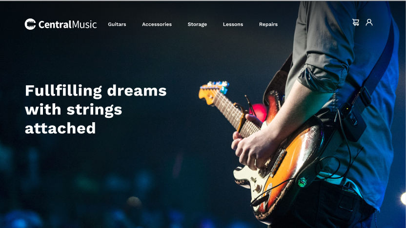
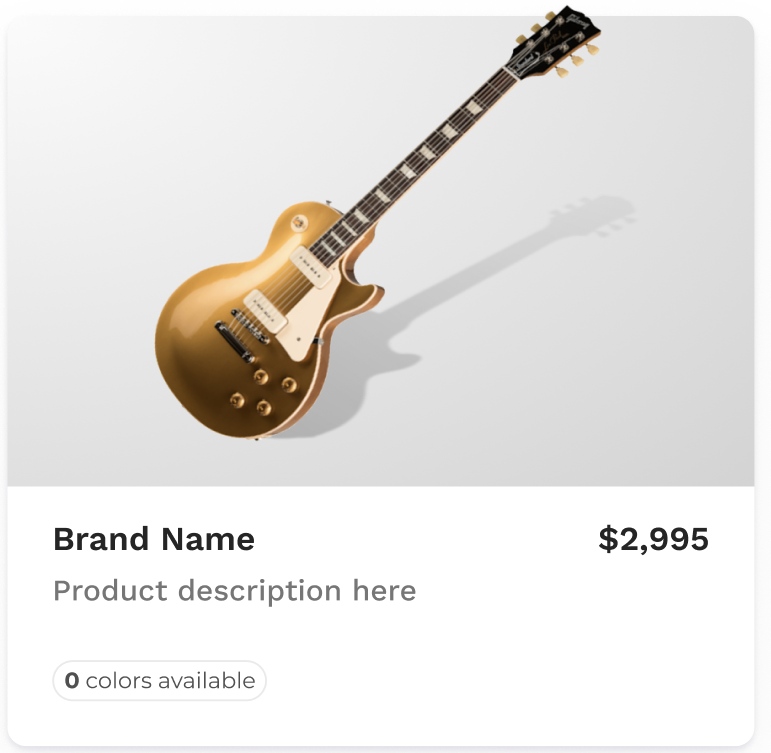
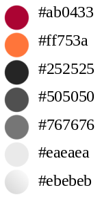

# Atividade 1
* Atividade baseado no [template](https://www.figma.com/design/jul072Wc1YF5J63r5kUMt5/Responsive-Music-Store-Template-(Community)?node-id=90-5838&p=f&t=jN3pGvFGhEKizVCX-0)
* Largura da página: 1440px

## Hero:
* Largura: 1440px
* Altura: 808px
* Fonte: Works Sans – 56px

## Navegação:
* Largura: 1242px
* Altura: 46px
* Fonte: Works Sans – 18px
* Procurar fontes para os ícones!

## Alerta:
* Largura: 1264px
* Altura: 280px
* Background: Arquivo alert.png
* Cor: white
* Fonte: Works Sans
    • FREE GUITAR LESSONS! - 46px
    • Purchase any guitar over $499.99 and … - 24px
    • LEARN MORE - 14px

## Seções:
* Títulos: New Products, Popular Finds, Gear Heads
* Fonte: Works Sans – 40px

## Cards de New Products e Popular Finds
* Brand Name: Works Sans – 18px
* $2,995: Works Sans – 18px
* Product description here: Works Sans – 16px
* 0 colors available: Montserrat - 12px

## Footer: 
* Procurar fontes para os ícones!
* Works Sans – 14px
    * My Account: Overview, Order History, Wishlist, Account information
    * Store, Security Notice, Location & Hours, Rentals, Privacy Notice
* ©2021 Music Store: Montserrat - 13px

## Cores:

#ab0433
#ff753a
#252525
#505050
#767676
#eaeaea
#ebebeb

